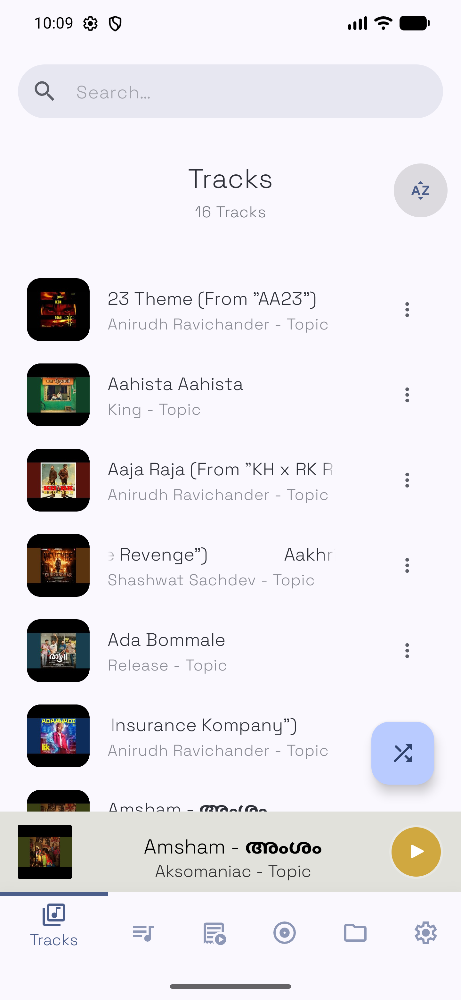
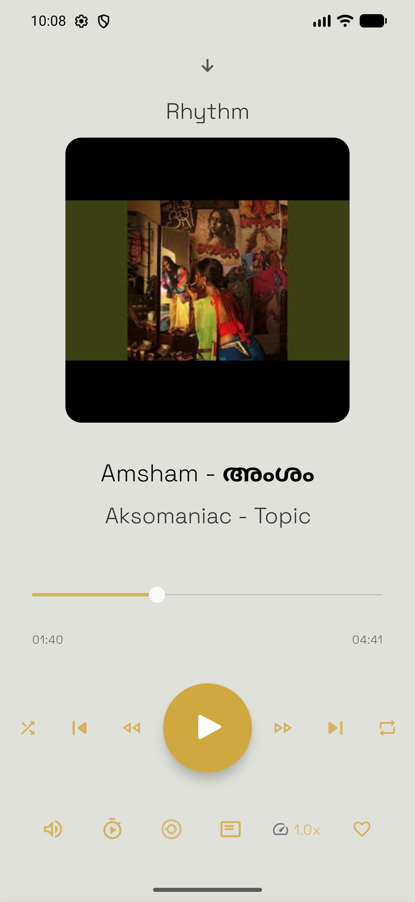
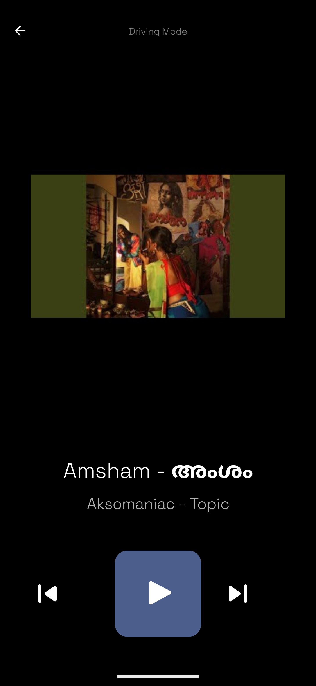
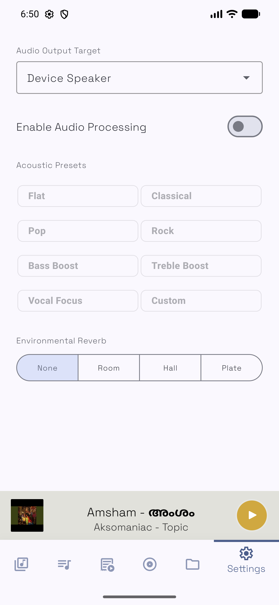
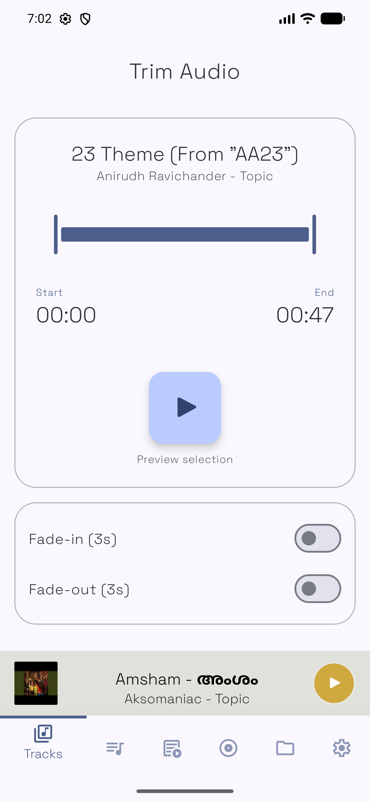
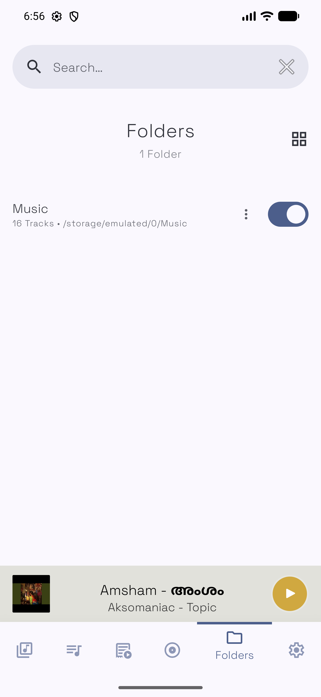
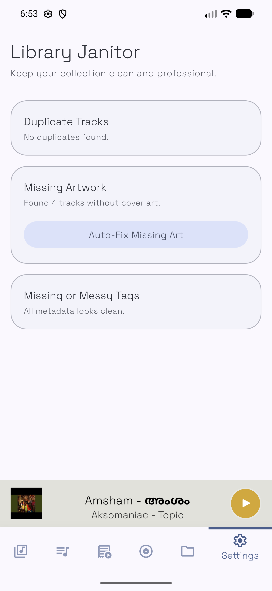

<p align="center">
  
</p>

# Rhythm - Android Music Player

<p align="center">
  <strong>A simple, elegant, and open-source music player for Android, built with modern practices.</strong>
</p>

<p align="center">
  
  
  <a href="https://rhythmmusicplayer.github.io"></a>
  
  
  
</p>

---

Rhythm is designed for users who want a distraction-free, high-quality audio experience. It combines a minimalist interface with powerful features like dynamic theming, a professional equalizer, and a built-in audio trimmer.

## 🌟 Visual Showcase

### 🎵 Immersive Playback
Experience your music with a beautiful, responsive UI that adapts its colors based on your album artwork.

<div align="center">
  <table>
    <tr>
      <td width="33%"></td>
      <td width="33%"></td>
      <td width="33%"></td>
    </tr>
    <tr align="center">
      <td>Track List</td>
      <td>Now Playing</td>
      <td>Driving Mode</td>
    </tr>
  </table>
</div>

### 🛠️ Professional Tools
Fine-tune your listening experience with precision audio controls.

<div align="center">
  <table>
    <tr>
      <td width="45%"></td>
      <td width="45%"></td>
    </tr>
    <tr align="center">
      <td>5-Band Equalizer</td>
      <td>Audio Trimmer</td>
    </tr>
  </table>
</div>

### 📁 Advanced Library Management
Keep your collection organized and healthy with ease.

<div align="center">
  <table>
    <tr>
      <td width="45%"></td>
      <td width="45%"></td>
    </tr>
    <tr align="center">
      <td>Folder Browser</td>
      <td>Library Janitor</td>
    </tr>
  </table>
</div>

---

## 🚀 Key Features

- **Core Playback**: High-fidelity audio powered by [Jetpack Media3](https://developer.android.com/guide/topics/media/media3) and ExoPlayer.
- **Material Design 3**: A modern, fluid interface with seamless animations and transitions.
- **Dynamic Colors**: UI colors that breathe with your music's album art using [Material You](https://m3.material.io/).
- **Driving Mode**: A simplified, large-button interface optimized for safe on-the-road use.
- **Audio Precision**: 5-Band Equalizer with custom presets and environmental reverb effects.
- **Smart Janitor**: Automatically scans for missing album art and cleans up metadata.
- **Audio Trimmer**: Create custom ringtones or clips directly within the app.
- **Integrated Lyrics**: Support for synced and static lyrics for a complete experience.

## 🛠️ Tech Stack

- **Language**: 100% Kotlin
- **UI Framework**: Jetpack Compose / Material 3
- **Audio Core**: Jetpack Media3 (ExoPlayer)
- **Image Loading**: Glide
- **Metadata**: JAudioTagger
- **Dependency Injection**: Koin (or Hilt - *User check*)

## 📦 Getting Started

### Download
Official releases and the companion website can be found at:
**[rhythmmusicplayer.github.io](https://rhythmmusicplayer.github.io)**

*Release builds coming soon.* In the meantime, you can build from source.

### Building from Source

1. Clone the repository:
   ```bash
   git clone https://github.com/sreejith19931/Rhythm.git
   ```
2. Open the project in **Android Studio Koala** or newer.
3. Ensure you have **Android SDK 37** installed.
4. Build and deploy to a device running **Android 8.0+**.

## 🤝 Contributing

Contributions are what make the open-source community such an amazing place to learn, inspire, and create. Any contributions you make are **greatly appreciated**.

1. Fork the Project
2. Create your Feature Branch (`git checkout -b feature/AmazingFeature`)
3. Commit your Changes (`git commit -m 'Add some AmazingFeature'`)
4. Push to the Branch (`git push origin feature/AmazingFeature`)
5. Open a Pull Request

## 📄 License

Distributed under the MIT License. See `LICENSE` for more information.

---
<p align="center">
  Made with ❤️ by Sreejith
</p>
